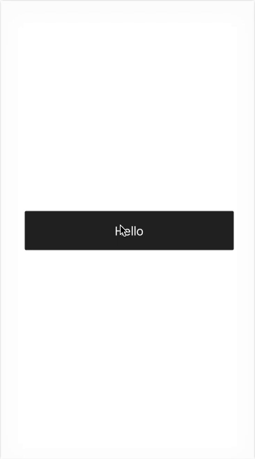

<h1 align="center">nanokit-button</h1>
<div align="center">
  <strong>A button component for React Native</strong>
</div>
<br>
<div align="center">
  <a href="https://npmjs.org/package/nanokit-button">
    
  </a>
  <a href="https://npmjs.org/package/nanokit-button">
  
  </a>
  <a href="https://github.com/feross/standard">
    
  </a>
  <a href="https://github.com/prettier/prettier">
    
  </a>
  <a href="https://travis-ci.org/tiaanduplessis/nanokit-button">
    
  </a>
  <a href="https://github.com/tiaanduplessis/nanokit-button/blob/master/LICENSE">
    
  </a>
  <a href="http://makeapullrequest.com">
    
  </a>
</div>
<br>
<div align="center">
  <a href="https://github.com/tiaanduplessis/nanokit-button/watchers">
    
  </a>
  <a href="https://github.com/tiaanduplessis/nanokit-button/stargazers">
    
  </a>
  <a href="https://twitter.com/intent/tweet?text=Check%20out%20nanokit-button!%20https://github.com/tiaanduplessis/nanokit-button%20%F0%9F%91%8D">
    
  </a>
</div>
<br>
<div align="center">
  Built with ❤︎ by <a href="https://github.com/tiaanduplessis">tiaanduplessis</a> and <a href="https://github.com/tiaanduplessis/nanokit-button/contributors">contributors</a>
</div>

<h2>Table of Contents</h2>
<details>
  <summary>Table of Contents</summary>
  <li><a href="#about">About</a></li>
  <li><a href="#install">Install</a></li>
  <li><a href="#usage">Usage</a></li>
  <li><a href="#contribute">Contribute</a></li>
  <li><a href="#license">License</a></li>
</details>

## About

A simple customizable button component for [React Native](https://facebook.github.io/react-native/). Uses [TouchableOpacity](https://facebook.github.io/react-native/docs/touchableopacity.html) on iOS and [TouchableNativeFeedback](https://facebook.github.io/react-native/docs/touchablenativefeedback.html) on Android.

## Install

```sh
$ npm install nanokit-button
# OR
$ yarn add nanokit-button
```

## Usage

```jsx
import React from 'react'
import { View, StyleSheet } from 'react-native'
import Button from 'nanokit-button'

const Example = () => (
  <View style={styles.container}>
    <Button width={200} text="Hello"/>
  </View>
)

const styles = StyleSheet.create({
  container: {flex: 1, justifyContent: 'center', alignItems: 'center'}
})
```

Results in:



See the [available props](index.js) for more info

## Contributing

Contributions are welcome!

1. Fork it.
2. Create your feature branch: `git checkout -b my-new-feature`
3. Commit your changes: `git commit -am 'Add some feature'`
4. Push to the branch: `git push origin my-new-feature`
5. Submit a pull request :D

Or open up [a issue](https://github.com/tiaanduplessis/nanokit-button/issues).

## License

Licensed under the MIT License.
